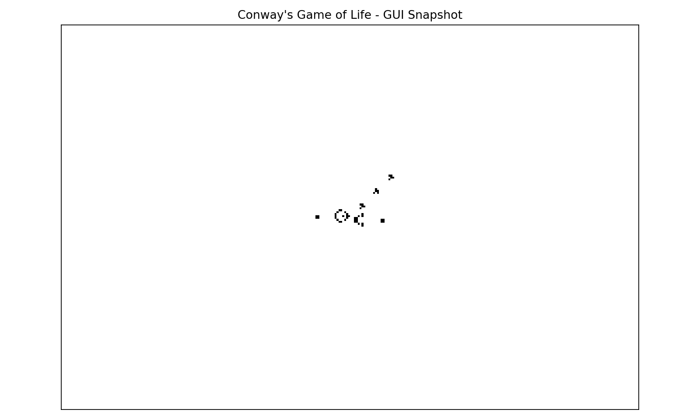

# Conway's Game of Life (Modernized)

Forked from: https://github.com/amaynez/GameOfLife

Interactive Conway's Game of Life with multiple simulation backends.
Default backend is `auto`, which adaptively profiles available engines and picks the fastest for the current board/rule.
Default UI is now terminal `tui` (retro black/white).



- `jvn`: built-in von Neumann-neighborhood Life-like rules (`B/S` over 0..4 neighbors).
- `generations`: built-in Generations family (`B/S/C`) multistate rules.
- `largerlife`: built-in Larger-than-Life range-`R` totalistic rules.
- `ruleloader`: built-in JSON rule-file engine inspired by Golly RuleLoader workflows.
- `quicklife`: QuickLife-inspired ROI-updating dense engine.
- `hashlife`: HashLife-inspired memoized transition cache.
- `hashlife-tree`: Built-in quadtree HashLife-style core with canonical node interning and memoized transitions/jumps.
- `numba`: JIT-compiled dense grid update kernel for high-throughput stepping.
- `torch`: CPU `conv2d` backend using an explicit Life kernel.

## What's improved

- Fixed off-by-one coordinate bugs on board boundaries.
- Modernized Matplotlib window-title handling (backend-safe).
- Added backend architecture to scale by workload profile.
- Dense vectorized stepping with NumPy.
- Dense JIT stepping with Numba.
- Interactive controls and configurable CLI options.

## Install

```bash
uv pip install -e .
```

For Torch backend support:

```bash
uv pip install -e '.[torch]'
```

## Run

```bash
gameoflife
```

Examples:

```bash
# Fast default (auto-adaptive backend selection)
gameoflife --pattern random --density 0.2 --width 600 --height 400 --interval 10

# Force GUI mode if needed
gameoflife --ui gui

# QuickLife-inspired engine
gameoflife --backend quicklife --pattern random --density 0.1 --width 1200 --height 800 --interval 20

# Generations (Brian's Brain default: B2/S/C3)
gameoflife --backend generations --pattern random --density 0.2 --width 800 --height 500 --interval 30

# von Neumann neighborhood rule (radius 1, B/S over 0..4 neighbors)
gameoflife --backend jvn --rule B2/S12 --pattern random --density 0.2 --width 800 --height 500

# von Neumann neighborhood rule with radius 2 (max neighbors = 12)
gameoflife --backend jvn --rule R2,B3/S23 --pattern random --density 0.2 --width 800 --height 500

# Custom Generations rule
gameoflife --backend generations --rule B3/S23/C5 --pattern random --density 0.2 --width 800 --height 500

# Larger-than-Life default (R2,B34-45,S34-58)
gameoflife --backend largerlife --pattern random --density 0.15 --width 900 --height 600 --interval 25

# Custom Larger-than-Life rule
gameoflife --backend largerlife --rule R3,B102-133,S102-142 --pattern random --density 0.12 --width 900 --height 600

# RuleLoader-style JSON spec
gameoflife --backend ruleloader --rule-file rules/example.rule.json --pattern random --density 0.2 --width 800 --height 500

# RuleLoader compatibility from .rule-like text (limited parser)
gameoflife --backend ruleloader --rule-file rules/example_compat.rule --pattern random --density 0.2 --width 800 --height 500

# HashLife-inspired memoized engine
gameoflife --backend hashlife --pattern glider-gun --width 1200 --height 800 --interval 20

# Quadtree HashLife-style core
gameoflife --backend hashlife-tree --pattern glider-gun --width 1200 --height 800 --interval 40

# Torch CPU convolution backend
gameoflife --backend torch --pattern random --density 0.2 --width 600 --height 400 --interval 10

# Retro terminal (black/white) TUI mode
gameoflife --ui tui --backend quicklife --pattern random --density 0.2 --width 220 --height 160 --interval 40
```

## Controls

- `space`: Pause / resume
- `n`: Single-step one generation (when paused)
- `r`: Reset to random board (using `--density`)
- `g`: Load Gosper glider gun
- `c`: Clear board
- `w`: Toggle bounded vs toroidal wrapping
- `up/down`: Increase/decrease simulation speed
- `q`: Quit (TUI mode)
- `+/-`: Increase/decrease simulation speed (TUI mode)

## CLI

```bash
gameoflife --help
```

Main options:

- `--ui {gui,tui}`
- `--backend {auto,jvn,generations,largerlife,ruleloader,quicklife,hashlife,hashlife-tree,numba,torch}`
- `--rule` for `jvn`/`generations`/`largerlife`
- `--rule-file` for `ruleloader`
- `--width`, `--height`
- `--pattern {glider-gun,random,empty}`
- `--density`, `--seed`
- `--wrap`
- `--interval`
- `--benchmark-steps N` (headless performance run)
- `--benchmark-all` (run all available backends with one command)
- `--doctor` (environment and backend diagnostics)

Benchmark example:

```bash
gameoflife --backend quicklife --pattern random --density 0.2 --width 1000 --height 700 --benchmark-steps 300
gameoflife --backend numba --pattern random --density 0.2 --width 1000 --height 700 --benchmark-steps 300
gameoflife --backend torch --pattern random --density 0.2 --width 1000 --height 700 --benchmark-steps 300
gameoflife --pattern random --density 0.2 --width 1000 --height 700 --benchmark-steps 300 --benchmark-all
```

## Notes

- Rules are canonical Conway Life: `B3/S23`.
- Random initialization now uses a fixed-size sample (`floor(width*height*density)`) consistently across backends.
- `jvn`, `generations`, and `largerlife` are built-in algorithm families with configurable rules via `--rule`.
- `ruleloader` loads JSON specs and a limited `.rule`-like text format via `--rule-file`.
- `auto` profiles candidate backends (`quicklife`, `hashlife`, `numba`, `torch`) and locks to the fastest.
- `quicklife` and `hashlife` are Golly-inspired ideas, not full algorithm-identical reimplementations.
- `hashlife-tree` includes a built-in multi-generation jump API (`advance(n)`) via memoized power-of-two jumps with adaptive boundary-safe fallback.
- Golly algorithm references:
  - https://golly.sourceforge.io/Help/algos.html
  - https://golly.sourceforge.io/Help/Algorithms/QuickLife.html
  - https://golly.sourceforge.io/Help/Algorithms/HashLife.html
- If `--backend numba` is selected but Numba is unavailable at runtime, the app falls back to `quicklife` and prints a warning.
- If `--backend torch` is selected but torch is unavailable at runtime, the app falls back to `quicklife` and prints a warning.
- Package/dependency interface is unified via `setup.py`.
